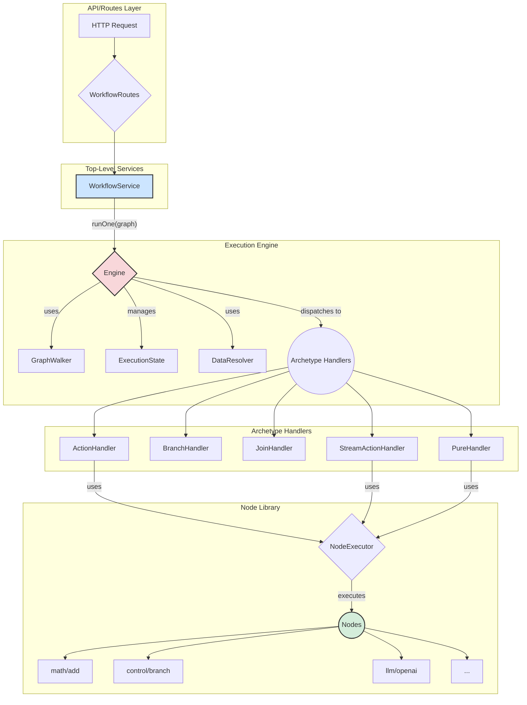

# 服务层架构总览 (`backend/src/services`)

本文档旨在提供 LucidFlow 后端服务层的高层次架构概览，核心是一个基于图的、信号驱动的工作流执行引擎。

## 1. 核心理念

整个服务层的设计围绕着一个核心概念：**工作流即图 (Workflow as a Graph)**。用户通过可视化界面定义的业务逻辑被表示为一个有向图，其中包含**节点 (Nodes)** 和 **边 (Edges)**。

-   **节点 (Nodes)**: 代表一个独立的操作单元，如数据转换、API 调用、逻辑判断等。
-   **边 (Edges)**: 定义了节点之间的依赖关系，代表着**数据流**或**控制流**的传递路径。

**执行引擎 (Engine)** 的职责就是解析这个图，并按照预定义的规则高效、可靠地执行其中定义的逻辑。

## 2. 架构图

## 3. 主要模块详解

### 3.1. 顶层服务 (Top-Level Services)

这是暴露给路由层的业务逻辑入口。

-   **`WorkflowService.ts`**:
    -   **职责**: 提供对工作流的 CRUD 操作，并作为执行工作流的统一入口 (`runOne` 方法)。
    -   **交互**: 它接收来自上层（Routes）的请求，通过 `WorkflowRepo` 与数据库交互，并在需要执行时实例化并调用 `Engine`。
    -   [查看详细介绍](./services/workflow_service.md) (待创建)

### 3.2. 执行引擎 (Execution Engine)

引擎是整个工作流处理的核心，负责驱动图的执行。它是一个**信号驱动 (Signal-Driven)** 的系统。

-   **`Engine`**:
    -   **职责**: 管理整个执行生命周期。它维护一个信号队列，循环处理队列中的信号，直到所有任务完成。
    -   **核心逻辑**:
        1.  接收一个图 (`graph`) 和起始参数。
        2.  初始化 `ExecutionState`、`GraphWalker` 和 `DataResolver`。
        3.  将起始节点的信号放入队列。
        4.  进入循环，取出信号，根据信号指向节点的 `archetype`（原型），分派给对应的 `Archetype Handler` 处理。
        5.  执行结束后，收集 `special/end` 节点的结果并返回。
-   **`ExecutionState`**:
    -   **职责**: 存储单次工作流执行的所有动态状态，包括信号队列、节点输出缓存、Join 节点状态和异步任务等。它保证了执行过程的隔离性和状态一致性。
-   **`GraphWalker`**:
    -   **职责**: 一个图的遍历工具类，提供了根据节点 ID 查找节点、查找下游节点等原子操作，解耦了引擎核心逻辑与图结构的直接交互。
-   **`DataResolver`**:
    -   **职责**: 在节点执行前，负责解析其所有输入端口所需的数据。它可以从 `ExecutionState` 的缓存中获取上游节点的输出，或者在需要时惰性执行 `pure` 类型的节点。
-   [查看详细介绍](./services/engine.md) (待创建)

### 3.3. 原型处理器 (Archetype Handlers)

处理器定义了不同类型节点的**控制流行为**。引擎通过组合这些行为来实现复杂的逻辑。

-   **`ActionHandler`**: 用于标准的同步操作。
-   **`BranchHandler`**: 实现条件分支逻辑。
-   **`JoinHandler`**: 实现多路输入的同步等待。
-   **`StreamActionHandler`**: 用于处理流式或长时间运行的异步任务。
-   **`PureHandler`**: 用于可以被惰性求值的纯函数节点。
-   [查看详细介绍](./services/handlers.md) (待创建)

### 3.4. 节点库 (Node Library)

节点库是具体业务逻辑的实现集合，位于 `nodes/` 目录下。

-   **`NodeExecutor`**:
    -   **职责**: 动态加载并执行特定节点的逻辑代码。
-   **节点 (Nodes)**:
    -   **结构**: 每个节点是一个独立的模块，按 `类别/名称/版本` 的目录结构组织。
    -   **功能**: 包含具体的业务逻辑实现 (`logic.ts`) 和元数据定义 (`definition.ts`)。这些节点是可插拔、可复用的，构成了 LucidFlow 功能的基础。
    -   [查看详细介绍](./services/nodes.md) (待创建)