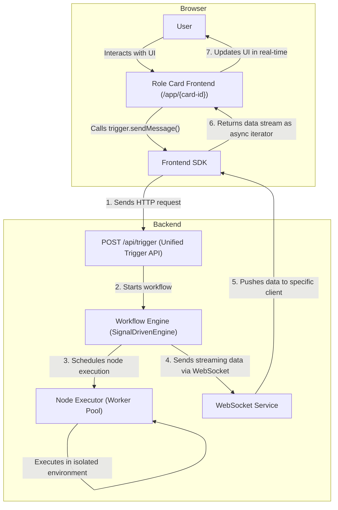

English | [简体中文](README.zh-cn.md)

# LucidFlow

**A WYSIWYG AI Agent & Workflow creation platform for advanced users.**

[//]: # (TODO: Add Badges: build status, version, license, Discord link, etc.)

> **Note**: LucidFlow is currently in a heavy, early development phase (Pre-Alpha). Many core features (such as node security isolation, dynamic imports, and marketplace distribution) are still under active development. We welcome adventurous developers and contributors to join us in shaping the future of LucidFlow!

LucidFlow aims to revolutionize the way complex AI agents are created. It combines the deep interaction philosophy of `sillytavern` with the visual workflow of `ComfyUI/n8n`, allowing developers and advanced users to design, build, and share interactive AI applications with unprecedented flexibility and intuition.

---

## ✨ Design Philosophy & Inspiration

### Why LucidFlow?

As the context windows of Large Language Models (LLMs) continue to expand, traditional Chat UIs are struggling to meet the demands of complex interactions. `sillytavern`, as an LLM frontend designed for advanced users, is powerful but its architecture introduces additional abstractions like "world books" and "presets", making it extremely difficult and counter-intuitive to build a complex agent with a stable internal state. Developers have to resort to "black magic" to work around its inherent limitations to implement what should be basic functionalities.

**Complexity doesn't disappear, it just gets shifted.** We believe that instead of patching over layers of abstraction, we should return to the source.

### Our Solution

Inspired by visual workflow software like `ComfyUI` and `n8n`, LucidFlow was born. We have discarded all non-essential abstract concepts, allowing creators to face and control the core logic from the very beginning. Through low-code, drag-and-drop node orchestration, everyone can intuitively design the behavior, memory, and interaction flow of their agents.

**Our design philosophy is:** a simple and flexible core with high extensibility, and what you see is what you get. We encourage creators to learn the necessary knowledge to build complex agents, rather than being trapped in the abstractions of specific tools. LucidFlow is a platform driven by the community, for the community.

We dislike all kinds of high-sounding marketing talk, so we don't promote "industry firsts" or "revolutionary" concepts, just do it!

## 🚀 Core Features

-   **Visual Workflow Orchestration**:
    Intuitively build complex backend processing flows from data processing and logical decisions to external API calls by dragging and dropping nodes and connecting flows.

-   **Role Card System**:
    This is the core innovation of LucidFlow. We package an independent frontend UI application and a backend workflow engine into a reusable "intelligent application unit". Each role card is a fully functional application with its own interface and logic, which can be easily shared and used.

-   **Streaming Responses & Frontend SDK**:
    We provide an extremely simple development experience for role card developers. Through a lightweight SDK, developers only need to call simple methods like `trigger.sendMessage()` to conduct real-time, two-way streaming data communication with the powerful backend workflow, easily building dynamic interactive interfaces such as real-time typing and progress updates.

-   **Future-Oriented Dynamic Node System (Planned)**:
    For the long-term sustainability of the project, we have designed a powerful dynamic node system, which is the top priority of our subsequent development.
    -   **Ultimate Developer Experience (DX)**: We plan to use the `lucidflow-cli` tool to enable node developers to achieve hot-reloading and real-time debugging at the source code level.
    -   **Absolute Stability**: The goal is to have each node run in a sandboxed environment in a separate Worker process, completely eliminating the risk of a single node's code defects (such as crashes or infinite loops) causing the entire main service to crash.
    -   **Enterprise-Grade Security**: We envision establishing a complete trust chain for third-party nodes from development and distribution to execution through white-box signing and OIDC identity authentication, ensuring the security and reliability of the node ecosystem.

-   **Backend-Centralized Internationalization (i18n) Architecture**:
    We have already set up a backend-centralized translation framework. Community contributors can easily add multi-language support for nodes, and the frontend application can automatically display the most appropriate text according to the user's browser language without any additional configuration, providing a zero-cost internationalization integration experience. (Note: Currently, only the framework is ready, and most of the translations have not been filled in yet).

## 🏗️ Architecture Overview

The core architecture of LucidFlow revolves around the "Role Card", ensuring a high degree of decoupling and flexible collaboration between frontend interaction and backend logic.



## 📈 Project Status: Early Alpha Phase

We firmly believe that a transparent development process is the cornerstone of community trust. Below is the current development status and future plans for LucidFlow.

### ✅ Implemented Core Features

We have laid a solid foundation for LucidFlow, and the prototype has been verified:

*   **Backend**:
    *   [x] Core SignalDrivenEngine
    *   [x] Node prototype processing and versioning
    *   [x] Dynamic loading of node declarations
    *   [x] Workflow saving, loading, and direct execution
    *   [x] Node stream processing and WebSocket state synchronization
    *   [x] Unified trigger (`/api/trigger`) implementation
    *   [x] Basic configuration center
*   **Frontend**:
    *   [x] Visual canvas with support for node dragging, connecting, and deleting
    *   [x] Dynamic ports for nodes
    *   [x] Automatic generation of configuration panels based on node `config.json`

### 🗺️ Roadmap

We have a clear plan to build LucidFlow from a prototype into a stable, powerful, and thriving platform.

#### **Phase 1: Laying the Core Foundation (In Progress)**

This is our current focus, with the goal of completing the core infrastructure of the platform.

-   [ ] **Node System Enhancement**:
    -   [ ] **Security Isolation**: Implement sandboxed execution of nodes based on `worker_threads`.
    -   [ ] **Dynamic Import & Distribution**: Complete the process of dynamic import, sharing, publishing, and installation of nodes.
-   [ ] **Workflow Functionality Enhancement**:
    -   [ ] **Subgraph Execution**: Support calling a workflow as a node in another workflow.
    -   [ ] **Import & Sharing**: Implement convenient import and sharing of workflows.
-   [ ] **Frontend Experience Improvement**:
    -   [ ] **Advanced Canvas Features**: Add features like node grouping and composition.
    -   [ ] **UI Refinement**: Continuously optimize UI/UX details.

#### **Phase 2: Expansion & Ecosystem**

Once the core foundation is stable, we will focus on expanding the platform's capabilities and building a node ecosystem.

-   [ ] **LLM Abstraction Layer**: Build a powerful LLM tool layer to encapsulate interactions with various model APIs (such as polling, retries, token caching, etc.) for easy use by node developers.
-   [ ] **Official Plugins & Compatibility**:
    -   [ ] **SillyTavern Role Card Importer**: Develop an official plugin to achieve compatibility with most simple and `mvu` role cards, reducing migration costs.
-   [ ] **Node Market**: Launch an official node market to provide a safe and trustworthy channel for node discovery and distribution.
-   [ ] **Internationalization Content Filling**: Recruit community contributors to fully populate translations for all languages.

## 🛠️ Quick Start

### Prerequisites
-   Node.js `(Recommended version: >=18.0.0)`
-   pnpm `(Recommended version: >=8.0.0)`

### Installation & Running

1.  **Clone the repository**
    ```bash
    git clone https://github.com/your-repo/lucidflow.git
    cd lucidflow
    ```

2.  **Install dependencies**
    ```bash
    pnpm install
    ```

3.  **Start the service**
    - **Windows**:
        ```bash
        start.bat
        ```
    - **Linux/macOS**:
        ```bash
        ./start.sh
        ```

### Node Development

For developers who want to create custom nodes, we have planned `lucidflow-cli` to optimize the development process (Note: The CLI tool is still under development).

## 🤝 How to Contribute

We warmly welcome and encourage community contributions! You can get involved in the following ways:
-   **Join our community**:
    -   [Discord](https://discord.gg/5mDTr3fR)
-   **Develop new nodes**: Extend the functionality of LucidFlow.
-   **Provide multi-language translations**: Help us bring LucidFlow to a wider audience.
-   **Submit bug reports or feature suggestions**: Let us know your thoughts on [GitHub Issues](https://github.com/your-repo/lucidflow/issues).
-   **Improve the documentation**: Help new users get started more quickly.

Before you start, please read our contribution guidelines (TODO: link to CONTRIBUTING.md).

## 📄 License

LucidFlow is licensed under the [GPL-3.0 License](LICENSE).