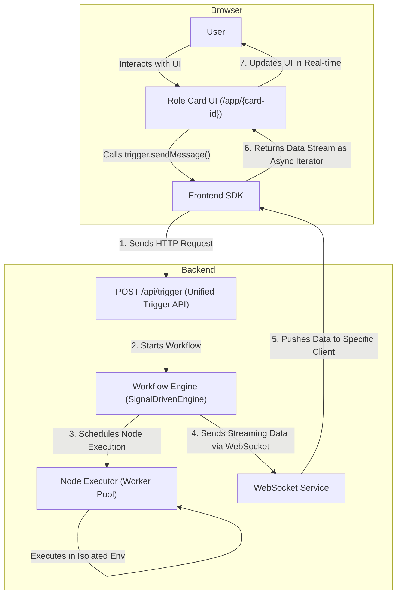

# LucidFlow

**A WYSIWYG AI character and workflow creation platform, designed for power users.**

[//]: # (TODO: Add badges for build status, version, license, Discord link, etc.)

> **Note**: LucidFlow is currently in an intensive, early development stage (Pre-Alpha). Many core features, such as secure node isolation, dynamic imports, and market distribution, are still under active development. We welcome early adopters, developers, and contributors to join us in shaping the future of LucidFlow!

LucidFlow aims to revolutionize the way complex AI characters are created. It combines the deep interaction philosophy of `sillytavern` with the visual workflow orchestration of `ComfyUI/n8n`, allowing developers and power users to design, build, and share interactive AI applications with unprecedented flexibility and intuition.

---

## ✨ Philosophy & Motivation

### Why LucidFlow?

As the context windows of Large Language Models (LLMs) continue to expand, traditional Chat UIs are struggling to meet the demands of complex interactions. `sillytavern`, a powerful LLM frontend for power users, introduced extra abstractions like "World Info" and "Character Expressions." While powerful, these features make building a complex character with stable internal states difficult and counter-intuitive. Developers often have to resort to "black magic" to bypass inherent limitations for what should be basic functionalities.

**Complexity doesn't disappear; it only gets transferred.** We believe that instead of patching over layers of abstraction, it's better to return to the fundamentals.

### Our Solution

Inspired by visual workflow software like `ComfyUI` and `n8n`, LucidFlow was born. We've discarded all non-essential abstract concepts, allowing creators to directly confront and control the core logic from the very beginning. Through low-code, drag-and-drop node orchestration, anyone can intuitively design a character's behavior, memory, and interaction flow.

**Our design philosophy is:** A simple, flexible, and highly extensible core. What you see is what you get. We encourage creators to learn the necessary skills for building complex characters, rather than being confined by the abstractions of a specific tool. LucidFlow is a platform driven by the community, for the community.

## 🚀 Core Features

-   **Visual Workflow Orchestration**:
    Intuitively build complex backend logic—from data processing and conditional logic to external API calls—by dragging, dropping, and connecting nodes.

-   **Role Card System**:
    This is the core innovation of LucidFlow. We bundle a standalone frontend UI application and its backend workflow engine into a reusable "smart application unit." Each Role Card is a fully functional application with its own interface and logic that can be easily shared and used.

-   **Streaming Response & Frontend SDK**:
    We provide an exceptionally streamlined development experience for Role Card creators. With a lightweight SDK, developers can establish real-time, bidirectional data streams with the powerful backend workflow engine using simple methods like `trigger.sendMessage()`. This makes it easy to build dynamic interfaces with features like real-time typing effects and progress updates.

-   **Future-Oriented Dynamic Node System (Planned)**:
    For the long-term sustainability of the project, we have designed a powerful dynamic node system, which is a key focus for our future development.
    -   **Ultimate Developer Experience (DX)**: We plan to use a `lucidflow-cli` tool to enable source-level hot-reloading and real-time debugging for node developers.
    -   **Absolute Stability**: The goal is to have each node run in an isolated Worker process, completely eliminating the risk of a single node's defect (like a crash or infinite loop) taking down the entire main service.
    -   **Enterprise-Grade Security**: We envision a complete chain of trust from development to distribution using whitelist signing and OIDC authentication for third-party nodes, ensuring a secure and reliable node ecosystem.

-   **Backend-Centered i18n Architecture**:
    We have established a backend-centered internationalization framework. Community contributors can easily add multi-language support for nodes, and the frontend application will automatically display the appropriate text based on the user's browser language with no extra configuration. (Note: The framework is ready, but most translations have not yet been populated).

## 🏗️ Architecture Overview

The core architecture of LucidFlow revolves around the "Role Card," ensuring a high degree of decoupling and flexible collaboration between the frontend interaction and backend logic.



## 📈 Project Status: Early Alpha Stage

We believe a transparent development process is the cornerstone of community trust. Here is the current development status and future roadmap for LucidFlow.

### ✅ Implemented Core Features

We have laid a solid foundation for LucidFlow, and the prototype has been successfully validated:

*   **Backend**:
    *   [x] Core SignalDrivenEngine
    *   [x] Node prototype handling and versioning
    *   [x] Dynamic loading of node declarations
    *   [x] Full workflow saving, loading, and direct execution
    *   [x] Node stream processing and WebSocket status synchronization
    *   [x] Unified trigger (`/api/trigger`) implementation
    *   [x] Basic configuration center
*   **Frontend**:
    *   [x] Visual canvas with support for node dragging, connecting, and deleting
    *   [x] Dynamic ports for nodes
    *   [x] Auto-generated configuration panel based on node `config.json`

### 🗺️ Roadmap

We have a clear plan to build LucidFlow from a prototype into a stable, powerful, and thriving platform.

#### **Phase 1: Laying the Core Foundation (In Progress)**

This is our current focus, aiming to complete the platform's core infrastructure.

-   [ ] **Node System Enhancements**:
    -   [ ] **Secure Isolation**: Implement sandboxed node execution based on `worker_threads`.
    -   [ ] **Dynamic Import & Distribution**: Complete the workflow for dynamic node import, sharing, publishing, and installation.
-   [ ] **Workflow Functionality Improvements**:
    -   [ ] **Subgraph Execution**: Support calling a workflow as a node within another workflow.
    -   [ ] **Import & Sharing**: Implement convenient import and sharing features for workflows.
-   [ ] **Frontend Experience Upgrades**:
    -   [ ] **Advanced Canvas Features**: Add features like node grouping and composition.
    -   [ ] **UI Refinement**: Continuously optimize UI/UX details.

#### **Phase 2: Expansion & Ecosystem**

Once the core foundation is stable, we will focus on expanding platform capabilities and building the node ecosystem.

-   [ ] **LLM Abstraction Layer**: Build a powerful LLM utility layer to encapsulate interactions with various model APIs (e.g., polling, retries, token caching), making it easier for node developers to use.
-   [ ] **Official Plugins & Compatibility**:
    -   [ ] **SillyTavern Character Card Importer**: Develop an official plugin to ensure compatibility with most simple and `mvu` character cards, reducing migration costs.
-   [ ] **Node Market**: Launch an official node market to provide a secure and trusted channel for discovering and distributing community-created nodes.
-   [ ] **Internationalization Content**: Recruit community contributors to fully populate translations for all supported languages.

## 🛠️ Getting Started

### Prerequisites
-   Node.js `(Recommended: >=18.0.0)`
-   pnpm `(Recommended: >=8.0.0)`

### Installation & Setup

1.  **Clone the repository**
    ```bash
    git clone https://github.com/your-repo/lucidflow.git
    cd lucidflow
    ```

2.  **Install dependencies**
    ```bash
    pnpm install
    ```

3.  **Start the backend server**
    ```bash
    cd backend
    pnpm run dev
    ```

4.  **Start the frontend server**
    ```bash
    cd frontend
    pnpm run dev
    ```

### Node Development

For developers who want to create custom nodes, we are planning a `lucidflow-cli` to streamline the development process (Note: The CLI tool is still under development).

## 🤝 Contributing

We warmly welcome and encourage community contributions! You can get involved in the following ways:
-   **Develop new nodes**: Extend the functionality of LucidFlow.
-   **Provide multi-language translations**: Help us bring LucidFlow to a wider audience.
-   **Submit bug reports or feature requests**: Let us know your ideas on [GitHub Issues](https://github.com/your-repo/lucidflow/issues).
-   **Improve the documentation**: Help new users get started more quickly.

Before you begin, please read our contribution guidelines (TODO: Link to CONTRIBUTING.md).

## 📄 License

LucidFlow is licensed under the [MIT License](LICENSE).