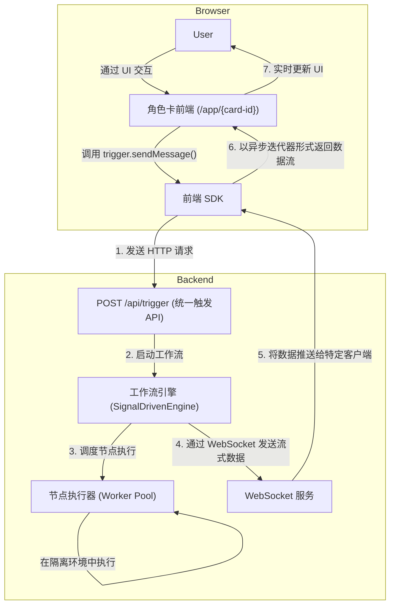

# LucidFlow

**一个为高级用户设计的、所见即所得的 AI 角色与工作流创建平台。**

[//]: # (TODO: 添加徽章 Badges: 构建状态, 版本, 许可证, Discord 链接等)

> **注意**: LucidFlow 目前正处于密集的早期开发阶段（Pre-Alpha）。许多核心功能（如节点安全隔离、动态导入、市场分发）仍在积极开发中。我们欢迎敢于尝鲜的开发者和贡献者加入我们，共同塑造 LucidFlow 的未来！

LucidFlow 旨在彻底改变复杂 AI 角色的创建方式。它将 `sillytavern` 的深度交互理念与 `ComfyUI/n8n` 的可视化工作流相结合，让开发者和高级用户能以前所未有的灵活性和直观性，设计、构建和分享可交互的 AI 应用。

---

## ✨ 设计哲学与灵感

### 为什么是 LucidFlow？

随着大型语言模型（LLM）的上下文窗口不断扩展，传统的 Chat UI 已难以满足复杂交互的需求。`sillytavern` 作为专为高级用户设计的 LLM 前端，虽然功能强大，但其架构设计引入了“世界书”、“预设”等额外抽象，使得构建一个具有稳定内部状态的复杂角色变得异常困难且反直觉。开发者不得不通过“黑魔法”般的方式，来绕过其固有限制，实现本应是基础的功能。

**复杂度不会消失，只会转移。** 我们认为，与其在层层抽象之上打补丁，不如回归本源。

### 我们的解决方案

受到 `ComfyUI` 和 `n8n` 等可视化工作流软件的启发，LucidFlow 诞生了。我们抛弃了所有非必要的抽象概念，让创造者从一开始就直面并掌控核心逻辑。通过低代码的拖拽式节点编排，每一个人都能直观地设计角色的行为、记忆和交互流程。

**我们的设计哲学是：** 内核简易灵活，可扩展性高，所见即所得。我们鼓励创造者去学习构建复杂角色所必需的知识，而不是将他们困于特定工具的抽象之中。LucidFlow 是一个由社区驱动、为社区服务的平台。

## 🚀 核心特性

-   **可视化工作流编排**:
    通过拖拽节点、连接流转，直观地构建从数据处理、逻辑判断到外部 API 调用的复杂后端处理流程。

-   **角色卡 (Role Card) 系统**:
    这是 LucidFlow 的核心创新。我们将独立的前端 UI 应用和后端工作流引擎打包成一个可复用的“智能应用单元”。每个角色卡都是一个功能完整的应用，拥有自己的界面和逻辑，可以被轻松地分享和使用。

-   **流式响应与前端 SDK**:
    我们为角色卡开发者提供了极致简洁的开发体验。通过一个轻量级的 SDK，开发者只需调用 `trigger.sendMessage()` 这样简单的方法，即可与强大的后端工作流进行实时、双向的流式数据通信，轻松构建如实时打字、进度更新等动态交互界面。

-   **面向未来的动态节点系统 (规划中)**:
    为了项目的长期可持续发展，我们设计了一套强大的动态节点系统，这是我们后续开发的重中之重。
    -   **极致的开发者体验 (DX)**: 规划借助 `lucidflow-cli` 工具，让节点开发者可以在源码级实现热重载与实时调试。
    -   **绝对的稳定性**: 目标是让每个节点都在独立的 Worker 进程中沙箱化执行，彻底杜绝单个节点的代码缺陷（如崩溃、死循环）导致整个主服务宕机的风险。
    -   **企业级的安全性**: 设想通过白盒签名与 OIDC 身份验证，为第三方节点建立从开发、分发到执行的完整信任链，确保节点生态的安全与可靠。

-   **后端中心化的国际化 (i18n) 架构**:
    我们已经搭建了后端中心化的翻译框架。社区贡献者可以轻松地为节点添加多语言支持，而前端应用无需任何额外配置，即可根据用户的浏览器语言自动展示最合适的文本，提供了零成本的国际化集成体验。（注意：目前仅框架就绪，大部分翻译尚未填充）。

## 🏗️ 架构概览

LucidFlow 的核心架构围绕“角色卡”展开，确保了前端交互与后端逻辑的高度解耦和灵活协作。



## 📈 项目状态：早期 Alpha 阶段

我们坚信透明的开发过程是社区信任的基石。以下是 LucidFlow 当前的开发状态和未来规划。

### ✅ 已实现的核心功能

我们已经为 LucidFlow 打下了坚实的基础，原型已经验证通过：

*   **后端**:
    *   [x] 核心信号驱动引擎 (SignalDrivenEngine)
    *   [x] 节点的原型处理与版本化
    *   [x] 节点声明的动态加载
    *   [x] 工作流的整体保存、读取与直接运行
    *   [x] 节点的流式处理与 WebSocket 状态同步
    *   [x] 统一触发器 (`/api/trigger`) 的实现
    *   [x] 基础配置中心
*   **前端**:
    *   [x] 可视化画布，支持节点拖拽、连线、删除
    *   [x] 节点的动态端口
    *   [x] 基于节点 `config.json` 自动生成配置面板

### 🗺️ 路线图 (Roadmap)

我们有一个清晰的计划，以将 LucidFlow 从原型构建成一个稳定、强大且生态繁荣的平台。

#### **第一阶段：奠定核心基础 (进行中)**

这是我们当前的焦点，目标是完成平台的核心基础设施。

-   [ ] **节点系统的完善**:
    -   [ ] **安全隔离**: 实现基于 `worker_threads` 的节点沙箱化执行。
    -   [ ] **动态导入与分发**: 完成节点的动态导入、分享、发布与安装流程。
-   [ ] **工作流功能的增强**:
    -   [ ] **子图执行**: 支持将工作流作为另一个工作流的节点来调用。
    -   [ ] **导入与分享**: 实现工作流的便捷导入和分享功能。
-   [ ] **前端体验的提升**:
    -   [ ] **高级画布功能**: 增加节点分组、组合等功能。
    -   [ ] **界面完善**: 持续优化 UI/UX 细节。

#### **第二阶段：扩展与生态**

在核心基础稳定后，我们将致力于扩展平台能力和构建节点生态。

-   [ ] **LLM 抽象层**: 构建一个强大的 LLM 工具层，封装与各类模型 API 的交互（如轮询、重试、Token 缓存等），方便节点开发者调用。
-   [ ] **官方插件与兼容性**:
    -   [ ] **SillyTavern 角色卡导入器**: 开发官方插件，实现对大部分简单和 `mvu` 角色卡的兼容，降低迁移成本。
-   [ ] **节点市场 (Node Market)**: 启动官方节点市场，提供安全、可信的节点发现与分发渠道。
-   [ ] **国际化内容填充**: 招募社区贡献者，全面填充各语言的翻译。

## 🛠️ 快速开始

### 环境要求
-   Node.js `(建议版本: >=18.0.0)`
-   pnpm `(建议版本: >=8.0.0)`

### 安装与运行

1.  **克隆仓库**
    ```bash
    git clone https://github.com/your-repo/lucidflow.git
    cd lucidflow
    ```

2.  **安装依赖**
    ```bash
    pnpm install
    ```

3.  **启动后端服务**
    ```bash
    cd backend
    pnpm run dev
    ```

4.  **启动前端服务**
    ```bash
    cd frontend
    pnpm run dev
    ```

### 节点开发

对于想要创建自定义节点的开发者，我们规划了 `lucidflow-cli` 来优化开发流程（注意：CLI 工具仍在开发中）。

## 🤝 如何贡献

我们热烈欢迎并鼓励社区的贡献！您可以通过以下方式参与进来：
-   **开发新的节点**: 扩展 LucidFlow 的功能。
-   **提供多语言翻译**: 帮助我们将 LucidFlow 带给更广泛的用户。
-   **提交 Bug 报告或功能建议**: 在 [GitHub Issues](https://github.com/your-repo/lucidflow/issues) 中让我们知道您的想法。
-   **改进文档**: 帮助新用户更快地上手。

在您开始之前，请阅读我们的贡献指南（TODO: 链接到 CONTRIBUTING.md）。

## 📄 许可证

LucidFlow 采用 [MIT 许可证](LICENSE)。