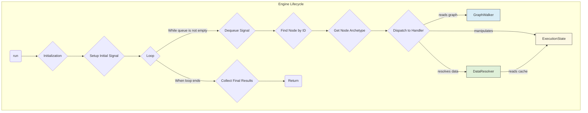

# 详解：执行引擎 (`engine/`)

执行引擎是 LucidFlow 工作流处理的核心，负责驱动图的执行。它是一个基于**信号 (Signal)** 的异步事件循环系统，确保了工作流的可靠、高效和可扩展。

## 1. 核心组件与流程

引擎的执行流程可以分解为以下几个关键组件的协作：

### 1.1. `Engine`

[`Engine`](../../../backend/src/services/engine/index.ts) 是主控制器。

-   **`run()` 方法**:
    1.  **初始化**: 创建 `GraphWalker`、`ExecutionState` 和 `DataResolver` 的实例。
    2.  **设置初始信号**: 根据传入的 `startNodeId`，将第一个控制信号放入 `ExecutionState` 的队列中，启动执行流程。
    3.  **启动循环 `loop()`**: 这是引擎的心跳。只要信号队列中还有待处理的信号，或者还有活动的异步任务，循环就会持续。
    4.  **收集结果**: 循环结束后，从 `special/end` 节点收集最终的输出并返回。

### 1.2. `GraphWalker`

[`GraphWalker`](../../../backend/src/services/engine/GraphWalker.ts) 是一个图遍历的辅助类。

-   **职责**:
    -   提供一个简单的 API 来查询图结构，例如 `findNodeById()`、`getDownstreamNodes()`。
    -   它将引擎的核心逻辑与图的具体数据结构（节点数组、边数组）解耦。
    -   负责获取节点的静态定义 (`NodeDefinition`)。

### 1.3. `ExecutionState`

[`ExecutionState`](../../../backend/src/services/engine/core/ExecutionState.ts) 是执行期间的“内存”或“上下文”。

-   **职责**:
    -   **信号队列 (Signal Queue)**: 存储待处理的 `Signal` 对象。一个信号代表一个需要引擎处理的事件，例如“激活节点 A 的 out 端口”。
    -   **节点缓存 (Node Cache)**: 存储已执行节点的输出结果。`DataResolver` 会优先从这里读取数据，避免重复计算。
    -   **Join 状态**: 为 `join` 原型的节点维护一个状态，跟踪哪些输入分支已经到达。
    -   **异步任务跟踪**: 记录活动的异步任务（如 `stream-action`），确保引擎在所有任务完成前不会提前终止。
    -   **钩子 (Hooks)**: 允许外部注入 `onNodeStart`, `onNodeEnd` 等回调，用于日志记录、调试或监控。

### 1.4. `DataResolver`

[`DataResolver`](../../../backend/src/services/engine/core/DataResolver.ts) 负责在节点执行前准备其所需的输入数据。

-   **职责**:
    -   **`resolveAllInputs()`**: 这是它的核心方法。对于一个给定的节点，它会遍历其所有输入数据端口。
    -   **数据来源**:
        1.  **直接连接**: 如果一个输入端口直接连接到上游节点的输出端口，`DataResolver` 会尝试从 `ExecutionState` 的缓存中读取该上游节点的输出。
        2.  **惰性求值**: 如果上游节点是一个 `pure` 原型的节点且其结果尚未被缓存，`DataResolver` 会**立即递归地执行**该 `pure` 节点以获得结果。
        3.  **字面量值**: 如果端口没有连接，但定义了默认值，则使用该默认值。
    -   这个机制确保了数据总是在需要时才被计算，并且只计算一次。

## 2. 信号 (Signal) 与循环 (Loop)

引擎的核心是**信号驱动**的。

-   **`Signal`**: 一个简单的对象，形如 `{ nodeId: string, portName: string, dataType: 'control' | 'data', data?: any }`。它描述了一个事件。
-   **`loop()`**:
    -   `while (state.hasActiveTasks())`: 循环会一直持续，直到信号队列为空 **并且** 没有任何活动的异步任务。
    -   在循环内部，它从队列中取出一个 `Signal`。
    -   根据 `signal.nodeId` 找到对应的节点实例。
    -   获取该节点的 `archetype`（如 'action', 'branch'）。
    -   从预先注册的 `handlers` Map 中找到对应的 `Handler` 实例，并将节点、信号和状态对象传递给它的 `handle()` 方法。

这种设计将**“何时执行”**（由引擎循环和信号队列决定）与**“如何执行”**（由具体的 `Handler` 决定）清晰地分离开来。