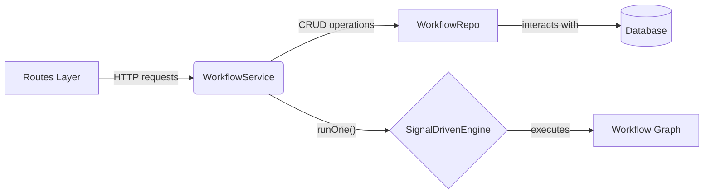

# 详解：`WorkflowService`

`WorkflowService` 是服务层的**门面 (Facade)**，它为上层应用（主要是 `routes`）提供了一个清晰、统一的接口来与工作流子系统进行交互。它封装了数据持久化和工作流执行的复杂性。

## 1. 职责

`WorkflowService` 的主要职责可以分为两类：

### 1.1. CRUD 操作

该服务封装了对 `WorkflowRepo` 的调用，提供对工作流 (`Workflow`) 和文件夹 (`Folder`) 模型的标准增、删、改、查功能。

-   `getTree()`: 获取工作流和文件夹的层级树状结构。
-   `getOne(id)`: 获取单个工作流的详细信息。
-   `addOne(workflow)`: 创建一个新的工作流。
-   `updateOne(id, workflow)`: 更新一个已存在的工作流。
-   `deleteOne(id)`: 删除一个工作流。
-   以及针对 `Folder` 的类似操作 (`addFolder`, `updateFolder`, `deleteFolder`)。

通过将数据访问逻辑限制在 `Repo` 层并通过 `Service` 层暴露，我们实现了关注点分离，使得上层代码无需关心数据库的具体实现。

### 1.2. 工作流执行

-   **`runOne(id)`**: 这是 `WorkflowService` 中最重要的方法，也是整个工作流执行的入口点。
    -   **流程**:
        1.  根据传入的 `id`，调用 `WorkflowRepo.getOne()` 从数据库中检索工作流的图数据。
        2.  如果未找到工作流，则抛出错误。
        3.  实例化一个新的 `SignalDrivenEngine` 对象。注意：引擎是**无状态**的，每次执行都会创建一个新的实例，确保了执行之间的完全隔离。
        4.  调用引擎的 `run()` 方法，将图数据 (`workflow.graph`) 传递给它。
        5.  `await` 等待引擎执行完成，并将其最终结果返回给调用方。

## 2. 在系统中的位置

`WorkflowService` 位于业务逻辑的核心层，起到了承上启下的作用：

它有效地将**“如何执行工作流”**的复杂内部机制（由 `Engine` 模块负责）与**“何时执行工作流”**的业务决策（由 `Routes` 和 `WorkflowService` 负责）分离开来。